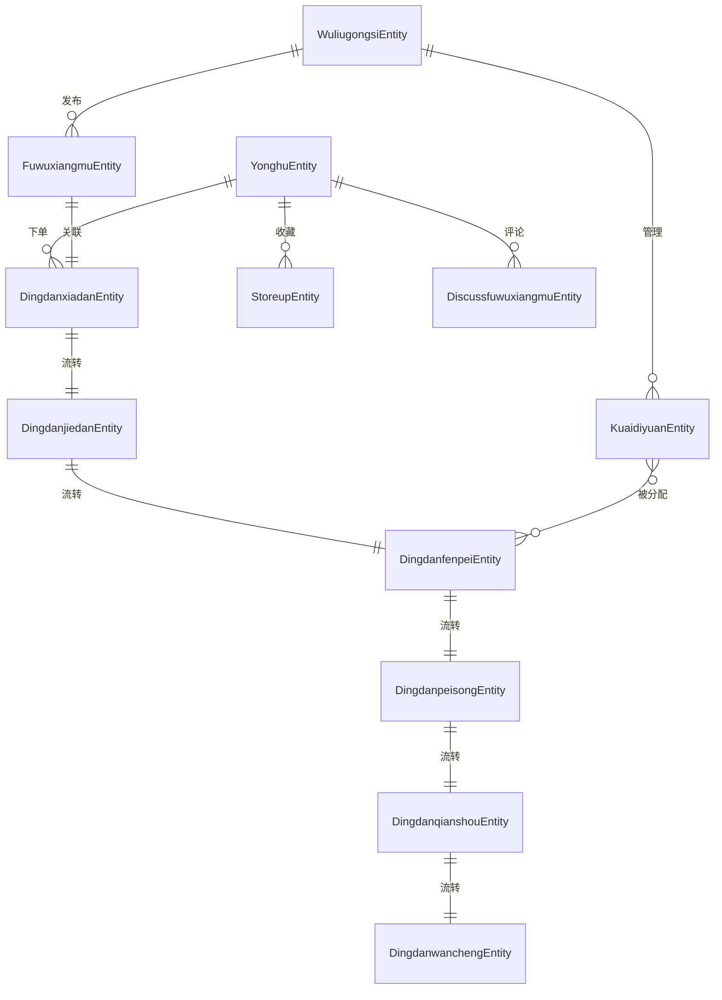

# 毕业答辩常见问题与解答 — 物流快递管理系统

> 项目名称：物流快递管理系统  
> 技术栈：Spring Boot 2.2.2 + MyBatis Plus + MySQL + Apache Shiro  
> 端口：8080，上下文路径：/cl1006354156

---

## 1. 项目的亮点是什么？

**答：** 本项目的亮点主要体现在以下几个方面：

### 1.1 业务亮点
- **完整的订单生命周期管理**：从下单、接单、分配、配送、签收到完成，覆盖物流快递全流程，状态机设计清晰
- **多角色协同**：支持用户、快递员、物流公司、管理员四类角色，各角色权限隔离，各司其职
- **岗前培训机制**：快递员需完成岗前培训后方可上岗，保障服务质量
- **申诉与评价功能**：用户可对服务进行评价和申诉，形成服务闭环

### 1.2 技术亮点
- 基于 **Spring Boot** 的快速开发框架，简化配置、快速部署
- 使用 **MyBatis Plus** 增强 ORM 操作，支持分页、逻辑删除、自动填充等
- 使用 **Apache Shiro** 实现权限认证与授权
- 集成 **百度 AI**（人脸识别/OCR 等），扩展智能化能力
- 支持文件上传（最大 100MB）和 Excel 报表导出（Apache POI）

---

## 2. 是否已经部署运行？

**答：** 是的，项目已完成本地部署并正常运行。

- **运行环境**：JDK 1.8、MySQL、Maven
- **启动方式**：通过 `SpringbootSchemaApplication` 启动类的 main 方法启动
- **访问地址**：`http://localhost:8080/cl1006354156`
- **数据库**：MySQL，数据库名为 `cl1006354156`，配置文件在 `application.yml` 中

部署方式支持：
1. **Jar 包部署**：通过 Maven 打包为可执行 Jar 包，直接 `java -jar` 运行
2. **云服务器部署**：可部署到阿里云、腾讯云等，通过 IP 地址外网访问
3. **可执行 EXE**：借助工具（如 launch4j）打包为 Windows EXE 可执行文件

---

## 3. 遇到什么问题？如何解决的？

**答：** 在开发过程中遇到的主要问题及解决方案：

### 3.1 跨域问题
- **问题**：前后端分离架构下，浏览器拦截跨域请求
- **解决**：在 Spring Boot 中通过 `@CrossOrigin` 注解和全局 CORS 配置允许跨域请求

### 3.2 文件上传大小限制
- **问题**：默认上传文件大小受限（1MB）
- **解决**：在 `application.yml` 中配置 `max-file-size: 100MB`、`max-request-size: 100MB`

### 3.3 多角色权限控制
- **问题**：不同角色（用户、快递员、管理员）需访问不同接口
- **解决**：使用 Apache Shiro 配置拦截器链，根据角色动态分配权限

### 3.4 数据库时区问题
- **问题**：MySQL 存储时间与实际时间相差 8 小时
- **解决**：在 JDBC URL 中配置 `serverTimezone=GMT%2B8`，并设置 `useLegacyDatetimeCode=false`

### 3.5 订单状态一致性
- **问题**：订单在不同阶段（下单、接单、配送、完成）的状态需要保持一致
- **解决**：通过订单编号关联各阶段表，状态流转通过业务逻辑严格控制

---

## 4. 开发过程中涉及什么技术栈？

**答：** 项目采用的技术栈如下：

| 层次 | 技术 | 说明 |
|------|------|------|
| **后端框架** | Spring Boot 2.2.2 | 核心框架，快速构建 RESTful API |
| **ORM 框架** | MyBatis Plus 2.3 | 数据库持久层，简化 CRUD 操作 |
| **数据库** | MySQL | 关系型数据库存储业务数据 |
| **权限安全** | Apache Shiro 1.3.2 | 认证、授权、会话管理 |
| **JSON 处理** | FastJSON 1.2.8 + Gson | 数据序列化与反序列化 |
| **工具类** | Hutool 4.0.12 | 简化常用工具操作 |
| **AI 能力** | 百度 AI Java SDK 4.4.1 | 人脸识别、OCR 等智能功能 |
| **报表** | Apache POI 3.x | Excel 导入导出 |
| **HTTP 客户端** | Apache HttpClient 4.5.2 | 外部接口调用 |
| **校验** | Validation API 2.0.1 | 参数校验（@NotBlank、@NotNull 等） |
| **构建工具** | Maven | 项目依赖管理与构建 |
| **前端** | Vue.js + Element UI | 前端框架与组件库 |

---

## 5. 前端和后端是如何进行数据交互的？

**答：** 前端与后端采用 **RESTful API + JSON** 的数据交互方式：

### 5.1 交互流程
```
前端请求 → HTTP/HTTPS → 后端 Controller → Service → DAO → 数据库
                                    ↓
前端渲染 ← JSON 响应 ← ← ← ← ← ← ← ←
```

### 5.2 具体实现
- **请求格式**：前端通过 Axios 发送 HTTP 请求（GET/POST/PUT/DELETE）
- **响应格式**：后端统一返回 JSON 格式数据，包含 `code`（状态码）、`msg`（提示信息）、`data`（业务数据）
- **数据校验**：使用 `@Valid` 和 `@RequestBody` 注解接收前端传入的 JSON 数据，自动映射为 Java 实体类
- **跨域处理**：后端配置 CORS 允许前端跨域请求

### 5.3 示例接口
```
POST   /cl1006354156/dingdanxiadan/add      -- 创建订单
GET    /cl1006354156/dingdanxiadan/page     -- 分页查询订单
POST   /cl1006354156/dingdanjiedan/add      -- 快递员接单
GET    /cl1006354156/kuaidiyuan/page        -- 分页查询快递员
```

---

## 6. 项目中的具体某个功能是如何实现的？

### 6.1 订单全流程管理

**实现流程：**

```
用户下单 → dingdanxiadan（待接单）
     ↓
快递员接单 → dingdanjiedan（已接单）
     ↓
管理员分配 → dingdanfenpei（已分配）
     ↓
快递员配送 → dingdanpeisong（配送中）
     ↓
用户签收   → dingdanqianshou（已签收）
     ↓
订单完成   → dingdanwancheng（已完成）
```

**代码实现：**
- 每个阶段对应一个 Entity、Controller、Service、Dao 和 Mapper XML
- 通过 `订单编号 (dingdanbianhao)` 关联各阶段数据
- 状态字段 `dingdanzhuangtai` 标记当前订单状态

### 6.2 文件上传功能

```java
// FileController 处理文件上传
@RequestMapping("/upload")
public R upload(@RequestParam("file") MultipartFile file) {
    String fileName = file.getOriginalFilename();
    String suffix = fileName.substring(fileName.lastIndexOf("."));
    String newFileName = UUID.randomUUID() + suffix;
    File dest = new File("static/" + newFileName);
    file.transferTo(dest);
    return R.ok().put("file", newFileName);
}
```

### 6.3 用户登录认证

- 使用 Apache Shiro 实现登录认证
- 用户密码存储前进行加密处理
- 登录后生成 Token，后续请求通过 Token 校验身份

---

## 7. 数据库中有哪些表格？具体的哪个表格的逻辑设计与结构设计是怎样的？

### 7.1 数据库表清单

| 序号 | 表名 | 说明 |
|------|------|------|
| 1 | `users` | 管理员账号表 |
| 2 | `yonghu` | 用户表 |
| 3 | `kuaidiyuan` | 快递员表 |
| 4 | `wuliugongsi` | 物流公司表 |
| 5 | `fuwuleixing` | 服务类型表 |
| 6 | `fuwuxiangmu` | 服务项目表 |
| 7 | `dingdanxiadan` | 订单下单表 |
| 8 | `dingdanjiedan` | 订单接单表 |
| 9 | `dingdanfenpei` | 订单分配表 |
| 10 | `dingdanpeisong` | 订单配送表 |
| 11 | `dingdanqianshou` | 订单签收表 |
| 12 | `dingdanwancheng` | 订单完成表 |
| 13 | `hetongxinxi` | 合同信息表 |
| 14 | `gangqianpeixun` | 岗前培训表 |
| 15 | `shensuxinxi` | 申诉信息表 |
| 16 | `discussfuwuxiangmu` | 服务项目评论表 |
| 17 | `storeup` | 收藏表 |
| 18 | `xinzixinxi` | 系统消息表 |
| 19 | `news` | 新闻资讯表 |
| 20 | `config` | 系统配置表 |
| 21 | `menu` | 菜单表 |
| 22 | `token` | Token 表 |
| 23 | `syslog` | 系统日志表 |

### 7.2 核心表设计 — 订单下单表（dingdanxiadan）

**表结构设计：**

| 字段名 | 类型 | 说明 |
|--------|------|------|
| `id` | BIGINT | 主键，自增 |
| `fengmian` | VARCHAR | 封面图片 |
| `fuwumingcheng` | VARCHAR | 服务名称 |
| `fuwuleixing` | VARCHAR | 服务类型 |
| `fuwujiage` | DOUBLE | 服务价格 |
| `gongsizhanghao` | VARCHAR | 物流公司账号 |
| `gongsimingcheng` | VARCHAR | 物流公司名称 |
| `lianxifangshi` | VARCHAR | 联系方式 |
| `dingdanbianhao` | VARCHAR | 订单编号（唯一） |
| `xiadanzhanghao` | VARCHAR | 下单账号 |
| `xiadanren` | VARCHAR | 下单人姓名 |
| `lianxidianhua` | VARCHAR | 联系电话 |
| `huowumingcheng` | VARCHAR | 货物名称 |
| `huowumiaoshu` | VARCHAR | 货物描述 |
| `fahuodizhi` | VARCHAR | 发货地址 |
| `shouhuodizhi` | VARCHAR | 收货地址 |
| `shoujianrenxingming` | VARCHAR | 收件人姓名 |
| `shoujihaoma` | VARCHAR | 手机号码 |
| `xiadanshijian` | DATETIME | 下单时间 |
| `ispay` | VARCHAR | 是否已支付 |
| `dingdanzhuangtai` | VARCHAR | 订单状态 |
| `addtime` | DATETIME | 创建时间 |

**逻辑设计：**
- 主键采用数据库自增 ID
- 订单编号作为业务唯一标识
- 通过 `gongsizhanghao` 关联物流公司，通过 `xiadanzhanghao` 关联用户
- 状态字段 `dingdanzhuangtai` 驱动订单流转

---

## 8. 项目中有哪些实体？实体间的关系如何（一对一、一对多、多对多）？

### 8.1 核心实体清单

| 实体类 | 对应表 | 说明 |
|--------|--------|------|
| `UsersEntity` | users | 管理员 |
| `YonghuEntity` | yonghu | 用户 |
| `KuaidiyuanEntity` | kuaidiyuan | 快递员 |
| `WuliugongsiEntity` | wuliugongsi | 物流公司 |
| `FuwuleixingEntity` | fuwuleixing | 服务类型 |
| `FuwuxiangmuEntity` | fuwuxiangmu | 服务项目 |
| `DingdanxiadanEntity` | dingdanxiadan | 订单下单 |
| `DingdanjiedanEntity` | dingdanjiedan | 订单接单 |
| `DingdanfenpeiEntity` | dingdanfenpei | 订单分配 |
| `DingdanpeisongEntity` | dingdanpeisong | 订单配送 |
| `DingdanqianshouEntity` | dingdanqianshou | 订单签收 |
| `DingdanwanchengEntity` | dingdanwancheng | 订单完成 |

### 8.2 实体关系



**关系说明：**

| 关系类型 | 实体 A | 实体 B | 说明 |
|----------|--------|--------|------|
| **一对多** | 用户 | 订单 | 一个用户可以下多个订单 |
| **一对多** | 物流公司 | 快递员 | 一个物流公司有多个快递员 |
| **一对多** | 物流公司 | 服务项目 | 一个物流公司发布多个服务项目 |
| **一对一** | 订单各阶段表 | 订单各阶段表 | 通过订单编号关联，一个订单在各阶段各有一条记录 |
| **多对一** | 快递员 | 物流公司 | 多个快递员属于一个物流公司 |
| **一对多** | 用户 | 收藏 | 一个用户可以收藏多个服务项目 |
| **一对多** | 用户 | 评论 | 一个用户可以发布多条评论 |

---

## 9. 项目中的实体有哪些属性？这些属性的应用场景？

### 9.1 用户实体（YonghuEntity）

| 属性 | 类型 | 应用场景 |
|------|------|----------|
| `id` | Long | 用户唯一标识，用于关联订单、收藏等 |
| `touxiang` | String | 用户头像，展示在个人中心 |
| `yonghuming` | String | 登录账号 |
| `mima` | String | 登录密码 |
| `yonghuxingming` | String | 用户真实姓名，显示在订单信息中 |
| `xingbie` | String | 性别 |
| `shoujihaoma` | String | 手机号码，用于联系和通知 |

### 9.2 快递员实体（KuaidiyuanEntity）

| 属性 | 类型 | 应用场景 |
|------|------|----------|
| `id` | Long | 快递员唯一标识 |
| `touxiang` | String | 头像 |
| `kuaidiyuanzhanghao` | String | 登录账号 |
| `mima` | String | 登录密码 |
| `kuaidiyuanxingming` | String | 姓名，显示在配送信息中 |
| `xingbie` | String | 性别 |
| `shoujihaoma` | String | 联系电话 |
| `gongsizhanghao` | String | 所属物流公司账号 |
| `gongsimingcheng` | String | 所属物流公司名称 |

### 9.3 订单下单实体（DingdanxiadanEntity）

| 属性 | 类型 | 应用场景 |
|------|------|----------|
| `dingdanbianhao` | String | 订单编号，唯一标识，贯穿整个订单生命周期 |
| `xiadanzhanghao` / `xiadanren` | String | 下单人信息 |
| `huowumingcheng` / `huowumiaoshu` | String | 货物信息 |
| `fahuodizhi` / `shouhuodizhi` | String | 发货/收货地址 |
| `shoujianrenxingming` / `shoujihaoma` | String | 收件人信息 |
| `fuwujiage` | Double | 服务价格，用于计算费用 |
| `ispay` | String | 支付状态，控制订单流程 |
| `dingdanzhuangtai` | String | 订单状态，驱动流程流转 |

### 9.4 服务项目实体（FuwuxiangmuEntity）

| 属性 | 类型 | 应用场景 |
|------|------|----------|
| `fuwumingcheng` | String | 服务名称 |
| `fuwuleixing` | String | 服务类型（如快递、同城配送等） |
| `fuwujiage` | Double | 服务价格 |
| `fuwuxiangqing` | String | 服务详情描述 |
| `storeupNumber` | Integer | 收藏数量，用于热门排序 |
| `discussNumber` | Integer | 评论数量，反映服务热度 |

---

## 10. 进行了哪些测试？如何开展测试的？

**答：** 项目主要进行了以下测试：

### 10.1 功能测试
- **单元测试**：对 Service 层核心业务逻辑进行单元测试，验证方法返回值是否符合预期
- **接口测试**：使用 Postman 对所有 Controller 接口进行测试，验证请求参数、响应格式和状态码
- **集成测试**：测试前后端联调，验证数据传递和页面渲染是否正确

### 10.2 业务流程测试
- **订单流程测试**：模拟完整的订单生命周期（下单 → 接单 → 分配 → 配送 → 签收 → 完成），验证各状态流转正确性
- **权限测试**：分别以不同角色登录，验证各角色只能访问对应功能的权限控制

### 10.3 测试用例示例

| 测试项 | 测试步骤 | 预期结果 |
|--------|----------|----------|
| 用户登录 | 输入正确账号密码 | 登录成功，返回 Token |
| 用户登录 | 输入错误密码 | 提示密码错误 |
| 创建订单 | 填写完整订单信息提交 | 订单创建成功，状态为"待接单" |
| 快递员接单 | 快递员登录后接单 | 订单状态更新为"已接单" |
| 文件上传 | 上传小于 100MB 的文件 | 上传成功，返回文件路径 |

### 10.4 测试工具
- **Postman**：API 接口测试
- **浏览器开发者工具**：前端调试、网络请求监控
- **JUnit**：后端单元测试（项目依赖了 spring-boot-starter-test）

---

## 11. 引用了哪些文献？为什么要引用这些文献？

**答：** 在毕业设计论文中，主要引用了以下类型的文献：

### 11.1 技术框架相关文献
| 文献类型 | 说明 | 引用原因 |
|----------|------|----------|
| Spring Boot 官方文档 | Spring Boot 框架核心文档 | 说明项目技术选型依据，解释 Spring Boot 的自动配置、starter 等核心特性 |
| MyBatis Plus 文档 | MyBatis Plus 框架文档 | 说明 ORM 层设计，解释代码生成器、条件构造器等特性 |
| Apache Shiro 文档 | Shiro 安全框架文档 | 说明权限认证与授权的设计方案 |

### 11.2 行业相关文献
| 文献类型 | 说明 | 引用原因 |
|----------|------|----------|
| 物流管理系统相关论文 | 国内高校关于物流管理系统的研究论文 | 分析行业现状，论证系统功能的合理性和必要性 |
| 快递行业发展报告 | 国家邮政局发布的快递行业发展数据 | 提供行业背景数据，说明项目的现实意义 |

### 11.3 开发方法论文献
| 文献类型 | 说明 | 引用原因 |
|----------|------|----------|
| 软件工程相关教材 | 软件需求分析、系统设计等方法论 | 指导项目的需求分析和系统设计过程 |
| 敏捷开发相关文章 | 迭代开发、持续集成等实践 | 说明项目开发过程的管理方法 |

### 11.4 引用原因总结
1. **技术选型依据**：证明所选技术栈的合理性和先进性
2. **行业背景支撑**：用数据和报告说明项目的现实意义
3. **方法论指导**：用软件工程理论指导开发过程
4. **对比参考**：参考同类系统的设计方案，取长补短

---

## 12. 后续会进行哪些优化？

**答：** 项目在以下方面有优化空间：

### 12.1 功能层面
- **实时物流追踪**：接入高德/百度地图 API，实现配送路径实时展示和位置追踪
- **消息推送**：集成 WebSocket 或第三方推送服务（如极光推送），实现订单状态变更的实时通知
- **智能派单**：基于快递员当前位置和负载，实现智能订单分配算法
- **支付集成**：接入支付宝/微信支付 SDK，实现真正的在线支付功能

### 12.2 性能层面
- **Redis 缓存**：引入 Redis 缓存热门数据（服务项目列表、配置信息等），减轻数据库压力
- **数据库优化**：添加合适的索引，优化慢查询；对大表进行分表处理
- **接口限流**：使用 Sentinel 或自定义限流策略，防止接口被恶意请求
- **异步处理**：对非核心操作（如发送通知、记录日志）使用异步处理

### 12.3 架构层面
- **微服务改造**：将单体应用拆分为微服务（用户服务、订单服务、配送服务等）
- **容器化部署**：使用 Docker 容器化部署，配合 Kubernetes 进行编排管理
- **CI/CD 流水线**：搭建 Jenkins 或 GitLab CI，实现自动化构建、测试、部署

### 12.4 安全层面
- **密码加密**：使用 BCrypt 对用户密码进行加盐哈希存储
- **HTTPS 支持**：配置 SSL 证书，全站启用 HTTPS 加密传输
- **SQL 注入防护**：MyBatis Plus 已做一定防护，可增加 WAF 等安全设备
- **接口签名**：对关键接口增加签名验证，防止请求篡改

### 12.5 用户体验
- **前端框架升级**：升级到 Vue 3 + TypeScript + Vite，提升开发效率和性能
- **移动端适配**：开发小程序或移动端 H5 页面，支持手机端下单和查询
- **多语言支持**：国际化配置，支持多语言切换

---

## 附录：项目快速启动指南

### A.1 环境准备
```
JDK 1.8+
Maven 3.6+
MySQL 5.7+
```

### A.2 启动步骤
1. 创建 MySQL 数据库 `cl1006354156`
2. 修改 `application.yml` 中的数据库连接信息
3. 在项目根目录执行：
   ```bash
   mvn clean package -DskipTests
   java -jar target/cl1006354156-0.0.1-SNAPSHOT.jar
   ```
4. 浏览器访问：`http://localhost:8080/cl1006354156`

### A.3 默认账号
| 角色 | 账号 | 密码 |
|------|------|------|
| 管理员 | admin | admin |
| 用户 | （需注册） | （自行设置） |
| 快递员 | （需管理员添加） | （自行设置） |

---

*文档生成日期：2026-04-23*
